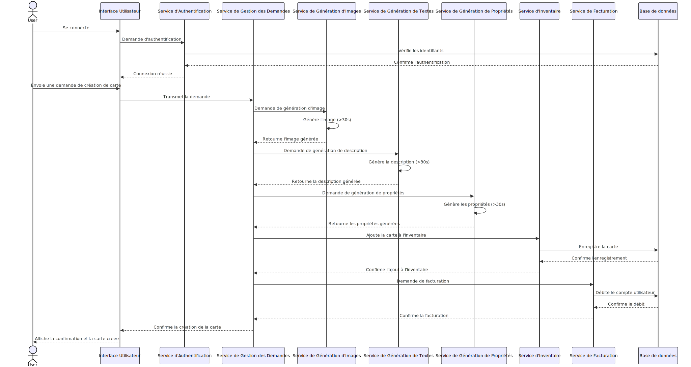

# ASI-ATELIER-1

## Question 1.1

## Question 1.2

| Nom | Description | Avantages | Inconvénients | Cas d'utilisation typiques |
|-----|-------------|-----------|---------------|----------------------------|
| Apache Kafka | Plateforme de streaming distribuée | - Haute performance - Scalabilité horizontale - Persistance des données | - Complexité de configuration - Courbe d'apprentissage élevée | - Traitement de flux en temps réel - Ingestion de données à grande échelle |
| RabbitMQ | Broker de messages | - Facile à utiliser - Protocoles multiples (AMQP, MQTT, etc.) - Bonnes performances | - Scalabilité limitée par rapport à Kafka - Persistance des messages moins robuste | - Communication asynchrone entre services - Systèmes de file d'attente |
| Apache ActiveMQ | Broker de messages open-source | - Supporte de nombreux protocoles - Flexible et extensible - Bonne intégration avec Java | - Performances moyennes pour des charges très élevées - Configuration complexe pour des cas avancés | - Intégration d'applications d'entreprise - Systèmes de messaging JMS |
| NATS | Système de messagerie léger et haute performance | - Très rapide et léger - Simple à utiliser - Supporte les modèles pub/sub et requête/réponse | - Fonctionnalités moins avancées que d'autres solutions - Persistance limitée | - Communication en temps réel - IoT et systèmes embarqués |
| ZeroMQ | Bibliothèque de messagerie distribuée | - Très léger et rapide - Pas besoin de broker central - Flexible et personnalisable | - Nécessite plus de développement pour des fonctionnalités avancées - Pas de persistance intégrée | - Communication inter-processus - Systèmes distribués personnalisés |
| Google Pub/Sub | Service de messagerie géré dans le cloud | - Entièrement géré et scalable - Intégration facile avec d'autres services Google Cloud - Latence globale faible | - Verrouillage du fournisseur (vendor lock-in) - Coûts potentiellement élevés à grande échelle | - Applications cloud natives - Analyses en temps réel |
| AWS SNS/SQS | Services de messagerie d'Amazon Web Services | - Haute disponibilité et durabilité - Intégration facile avec d'autres services AWS - Modèles pub/sub (SNS) et file d'attente (SQS) | - Verrouillage du fournisseur - Coûts potentiellement élevés à grande échelle | - Applications serverless - Architectures découplées dans AWS |
